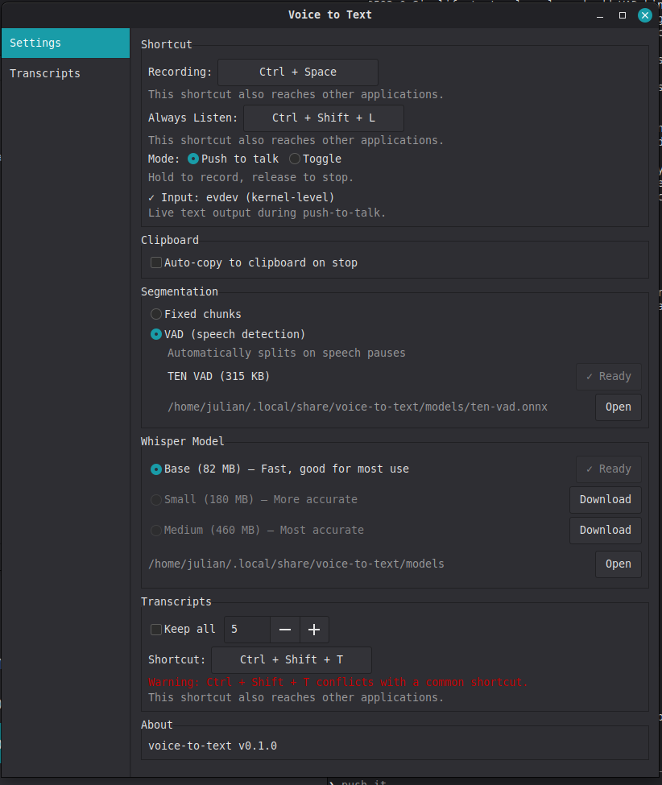
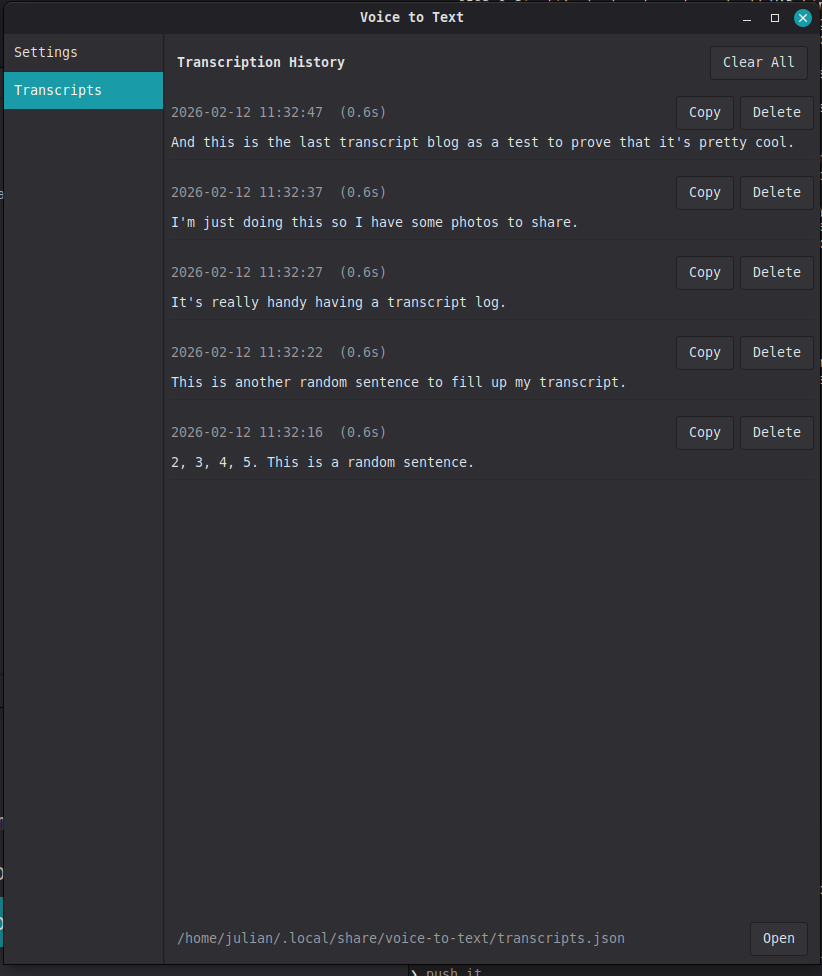
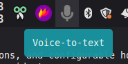

# Voice to Text

System-wide voice-to-text dictation tool for Linux. Transcribes speech using [whisper.cpp](https://github.com/ggerganov/whisper.cpp) and types the result directly into the focused window.




## Features

- **Push-to-Talk** — hold a hotkey, speak, release to transcribe and type
- **Always Listen** — toggle continuous dictation that transcribes each spoken phrase as you go
- **System tray** — grey (idle), blue (push-to-talk), red (always listen) mic icon with right-click menu
- **VAD (Voice Activity Detection)** — uses [TEN-VAD](https://github.com/AgoraIO-Community/ten-vad-rs) to split speech into natural segments
- **Live typing** — text is typed into the focused window in real time as each segment is transcribed
- **Transcript history** — saves all transcriptions; browse and click-to-copy from the tray submenu or settings window
- **Configurable hotkeys** — recording, always listen, and transcript window shortcuts are all rebindable in the settings UI
- **Model selection** — download Base (82 MB), Small (180 MB), or Medium (460 MB) whisper models from the settings UI
- **X11 + Wayland** — works on both display servers
- **D-Bus interface** — control the daemon programmatically via `org.voicetotext.Daemon`

## Requirements

### Build dependencies

- Rust toolchain (1.70+)
- C/C++ compiler (for whisper.cpp)
- CMake
- GTK 3 development libraries
- ALSA development libraries
- libxdo development libraries

On Ubuntu/Debian:

```sh
sudo apt install build-essential cmake libgtk-3-dev libasound2-dev libxdo-dev
```

On Fedora:

```sh
sudo dnf install gcc gcc-c++ cmake gtk3-devel alsa-lib-devel libxdo-devel
```

On Arch Linux:

```sh
sudo pacman -S base-devel cmake gtk3 alsa-lib xdotool pipewire-alsa
```

Or use the install script to install all dependencies (build + runtime) automatically:

```sh
./install_dependencies.sh
```

The script supports apt (Debian/Ubuntu), dnf (Fedora/RHEL), and pacman (Arch). On Arch, it also sets up the ydotool system service and uinput module.

### Runtime dependencies

- **X11**: `xdotool` for typing text into windows
- **Wayland (wlroots / smithay — Sway, Hyprland, niri)**: `wtype` for typing text
- **Wayland (KWin / Mutter — KDE Plasma, GNOME)**: `ydotool` for typing text (requires ydotoold service)
- **Clipboard**: `wl-copy` (Wayland) or `xclip` (X11)
- **Audio (PipeWire systems)**: `pipewire-alsa` for ALSA-to-PipeWire routing

The Wayland typing split comes down to the `virtual-keyboard-v1` protocol: wlroots- and smithay-based compositors implement it (so `wtype` works), while KWin and Mutter don't, which is why those fall back to `ydotool` → `/dev/uinput`.

## Building

```sh
cargo build --release
```

The binary is at `target/release/voice-to-text`.

## Installation

```sh
# Copy binary
sudo cp target/release/voice-to-text /usr/local/bin/

# Copy desktop entry (optional, for app launchers)
sudo cp voice-to-text.desktop /usr/share/applications/

# Copy icon (optional)
sudo cp assets/icon-256.png /usr/share/icons/hicolor/256x256/apps/voice-to-text.png
```

## Usage

```sh
voice-to-text
```

The app starts in the system tray. On first run, open Settings to download a whisper model.

### Hotkeys

| Action | Default | Description |
|---|---|---|
| Push-to-Talk | `Ctrl + Space` | Hold to record, release to transcribe |
| Always Listen | `Ctrl + Shift + L` | Toggle continuous dictation on/off |
| Transcripts | `Ctrl + Shift + T` | Open the transcripts window |

All hotkeys are configurable in the Settings window.

### Recording modes

The push-to-talk hotkey behavior depends on the mode selected in settings:

- **Push to Talk** — hold the key to record, release to stop and transcribe
- **Toggle** — press once to start recording, press again to stop

### Tray icon



- **Left-click** — opens the settings window
- **Right-click** — context menu with:
  - **Always Listen** / **Stop Listening** — toggle always listen mode
  - **Settings** — open settings window
  - **Transcripts** — submenu with recent transcriptions (click to copy)
  - **Quit**

### Tray icon colors

| Color | State |
|---|---|
| Grey | Idle |
| Blue | Push-to-talk active |
| Red | Always listen active |

### D-Bus

Control the running instance from the command line or scripts:

```sh
# Toggle recording
dbus-send --session --dest=org.voicetotext.Daemon \
  /org/voicetotext/Daemon org.voicetotext.Daemon.Toggle

# Quit
dbus-send --session --dest=org.voicetotext.Daemon \
  /org/voicetotext/Daemon org.voicetotext.Daemon.Quit
```

Only one instance runs at a time — launching a second instance sends a toggle command to the existing one.

## Configuration

Config is stored at `~/.config/voice-to-text/config.toml`. It can be edited manually or through the Settings UI.

```toml
model = "ggml-base.en-q8_0.bin"
clipboard_auto_copy = true
use_vad = false
chunk_duration_secs = 3.0
recording_mode = "push_to_talk"
shortcut = "ctrl+space"
transcript_shortcut = "ctrl+shift+t"
always_listen_shortcut = "ctrl+shift+l"
max_transcripts = 0
```

- `model` — whisper model filename (downloaded to `~/.local/share/voice-to-text/models/`)
- `clipboard_auto_copy` — automatically copy transcriptions to clipboard
- `use_vad` — use VAD-based speech segmentation (recommended) vs fixed-duration chunks
- `chunk_duration_secs` — chunk size when VAD is disabled (2.0–10.0s)
- `recording_mode` — `push_to_talk` or `toggle`
- `shortcut` / `transcript_shortcut` / `always_listen_shortcut` — hotkey bindings
- `max_transcripts` — max saved transcripts (0 = unlimited)

## Data locations

| Path | Contents |
|---|---|
| `~/.config/voice-to-text/config.toml` | Configuration |
| `~/.local/share/voice-to-text/models/` | Whisper and VAD models |
| `~/.local/share/voice-to-text/transcripts.json` | Transcript history |

## Platform compatibility

Linux desktop fragmentation means different display servers, compositors, and audio systems require different backends. The app handles this with automatic fallback chains:

| Component | X11 | Wayland (wlroots / smithay) | Wayland (KWin / Mutter) |
|---|---|---|---|
| **Text typing** | xdotool | wtype | ydotool |
| **Clipboard** | arboard / xclip | wl-copy | wl-copy |
| **Hotkeys** | global_hotkey | evdev | evdev |
| **Audio** | cpal (ALSA) | cpal + pipewire-alsa | cpal + pipewire-alsa |

"wlroots / smithay" covers Sway, Hyprland, river, niri, and similar compositors that implement `virtual-keyboard-v1`. "KWin / Mutter" covers KDE Plasma and GNOME on Wayland, which don't expose that protocol to arbitrary clients and so need the uinput-based path.

### Arch Linux notes

Arch is minimal and requires manual setup for some components:

- **Audio**: Install `pipewire-alsa` so cpal (ALSA-based) can route through PipeWire
- **ydotool**: Needs a system-level systemd service since the packaged user service lacks `/dev/uinput` permissions. Create `/etc/systemd/system/ydotoold.service`:
  ```ini
  [Unit]
  Description=ydotoold daemon

  [Service]
  ExecStartPre=/usr/sbin/modprobe uinput
  ExecStart=/usr/bin/ydotoold --socket-path=/run/ydotoold/socket --socket-perm=0666
  RuntimeDirectory=ydotoold
  Restart=on-failure
  RestartSec=3

  [Install]
  WantedBy=multi-user.target
  ```
  Then: `sudo systemctl enable --now ydotoold`
- **User groups**: Add your user to the `input` group for evdev hotkey access: `sudo usermod -aG input $USER`

### Distro package summary

| Package | Arch | Ubuntu/Debian |
|---|---|---|
| pipewire-alsa | `pacman -S pipewire-alsa` | Included by default |
| xdotool (X11) | `pacman -S xdotool` | `apt install xdotool` |
| wtype (wlroots / smithay) | `pacman -S wtype` | `apt install wtype` |
| ydotool (KWin / Mutter) | `pacman -S ydotool` | `apt install ydotool` |
| wl-clipboard | `pacman -S wl-clipboard` | `apt install wl-clipboard` |

## Architecture

The app uses a multi-threaded architecture with crossbeam channels for communication:

```
┌────────────┐     ┌─────┐     ┌──────────────┐     ┌────────────┐
│ Audio (cpal)│────→│ VAD │────→│ Whisper (C++) │────→│ Coordinator│
└────────────┘     └─────┘     └──────────────┘     └──────┬─────┘
                                                           │
                           ┌───────────────────────────────┤
                           │              │                 │
                      ┌────▼───┐   ┌──────▼─────┐   ┌──────▼──────┐
                      │  Tray  │   │  Hotkey    │   │ Text Output │
                      │  (GTK) │   │ (evdev/X11)│   │(xdotool/etc)│
                      └────────┘   └────────────┘   └─────────────┘
```

- **Audio** — captures mic input at 16kHz mono via cpal
- **VAD** — detects speech boundaries using TEN-VAD (ONNX model)
- **Whisper** — transcribes audio segments using whisper.cpp
- **Coordinator** — central event loop routing commands and results
- **Hotkey** — evdev (preferred, works everywhere) with global_hotkey fallback (X11 only)
- **Tray** — GTK3 system tray with muda menus
- **Output** — types text via xdotool/wtype/ydotool, copies to clipboard

## License

MIT
